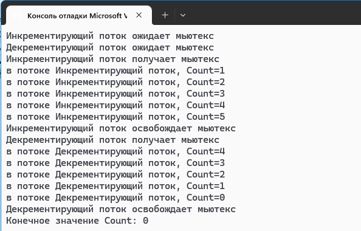

# Программа на C# с потоками и мьютексами

Данная программа демонстрирует использование потоков и мьютексов в языке программирования C#. В ней два потока взаимодействуют с общим ресурсом, инкрементируя и декрементируя его значение. Программа обеспечивает безопасный доступ к общему ресурсу с помощью мьютексов.

## Описание

- **Общий ресурс**: переменная `Count`, которая инкрементируется одним потоком и декрементируется другим.
- **Потоки**:
  - **Инкрементирующий поток**: увеличивает значение `Count`.
  - **Декрементирующий поток**: уменьшает значение `Count`.
- **Синхронизация**: доступ к `Count` синхронизирован с помощью объекта `Mutex`, что предотвращает возникновение условий гонки.

## Структура проекта

- **SharedRes**: класс, содержащий общий ресурс и объект мьютекса.
- **IncThread**: класс, представляющий инкрементирующий поток.
- **DecThread**: класс, представляющий декрементирующий поток.
- **Program**: основной класс, запускающий потоки и выводящий конечное значение `Count`.

## Работа проекта
